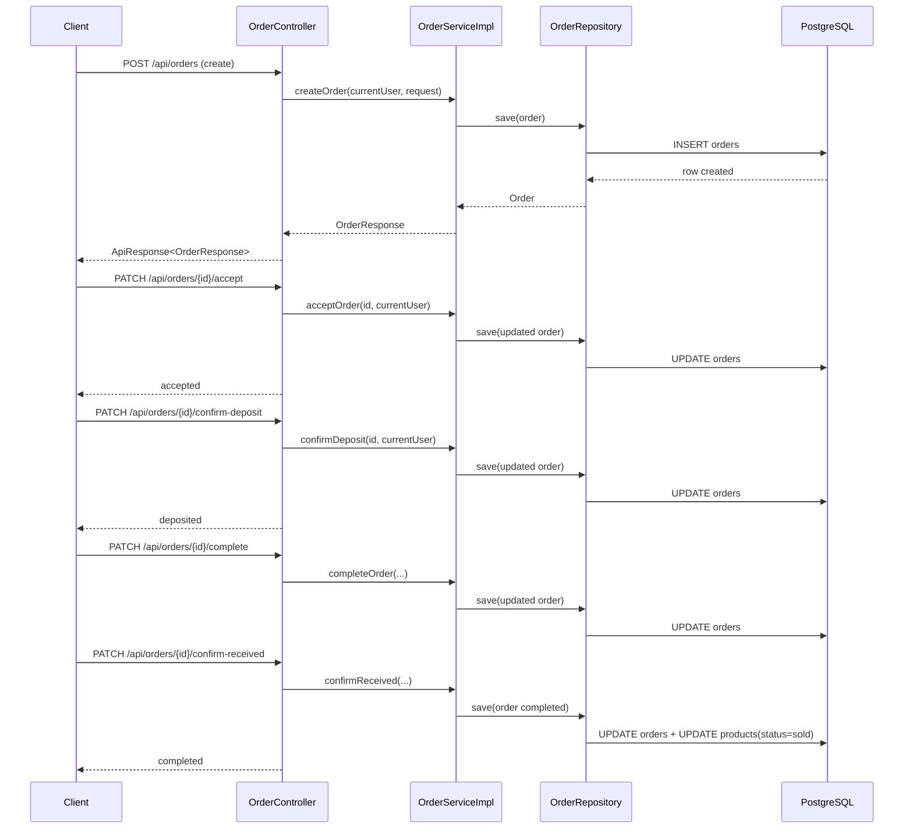

# Luồng mua xe cơ bản trong backend (Order Flow)

## 1) Bối cảnh vấn đề

Khi người mua bấm mua xe, hệ thống cần đi qua nhiều bước: tạo đơn, người bán chấp nhận, xác nhận cọc, báo đã giao, người mua xác nhận đã nhận.

Nếu không có luồng trạng thái rõ ràng, dữ liệu rất dễ sai (ví dụ: đơn đã hủy nhưng vẫn chuyển sang hoàn tất).

---

## 2) Định nghĩa khái niệm

- **Order**: đơn giao dịch giữa người mua và người bán cho một sản phẩm.
- **Order status**: trạng thái nghiệp vụ của đơn (pending, deposited, completed...).
- **Funding status**: trạng thái dòng tiền (unpaid, awaiting_payment, held...).
- **Transition**: chuyển trạng thái từ bước trước sang bước sau theo luật.

---

## 3) Vì sao quan trọng

- Giữ dữ liệu nhất quán.
- Chặn thao tác sai vai trò (buyer/seller/admin).
- Dễ debug: chỉ cần nhìn status hiện tại là biết đơn đang ở bước nào.

---

## 4) Ví dụ nhỏ

Ví dụ đúng:

`pending + unpaid -> accept -> pending + awaiting_payment -> confirm-deposit -> deposited + held`

Ví dụ sai:

`pending + unpaid -> confirm-received` (bị từ chối vì chưa giao xe).

---

## 5) Áp dụng trong project này

Các file chính:

- Controller: `src/main/java/swp391/old_bicycle_project/controller/OrderController.java`
- Service interface: `src/main/java/swp391/old_bicycle_project/service/OrderService.java`
- Service impl: `src/main/java/swp391/old_bicycle_project/service/OrderServiceImpl.java`
- Repository: `src/main/java/swp391/old_bicycle_project/repository/OrderRepository.java`
- Entity: `src/main/java/swp391/old_bicycle_project/entity/Order.java`
- Product entity: `src/main/java/swp391/old_bicycle_project/entity/Product.java`

### Sơ đồ luồng chính

### Diễn giải từng lớp

1. **Client gửi gì**: JSON tạo đơn hoặc gọi endpoint chuyển trạng thái.
2. **Controller làm gì**: nhận request, lấy `currentUser`, gọi service.
3. **Service quyết định gì**: kiểm tra quyền, kiểm tra trạng thái hiện tại, chuyển trạng thái hợp lệ.
4. **Repository làm gì**: đọc/ghi entity `Order` và `Product`.
5. **Database đổi gì**: cập nhật các cột trạng thái trong bảng `orders`, `products`.
6. **Response trả về**: `ApiResponse<OrderResponse>` để frontend hiển thị.

---

## 6) Lỗi thường gặp

1. **Sai vai trò**: buyer gọi endpoint của seller (`accept`, `confirm-deposit`).
2. **Sai thứ tự bước**: gọi `confirm-received` khi đơn chưa ở `awaiting_buyer_confirmation`.
3. **Không kiểm tra funding status**: dễ làm đơn bị “nhảy” trạng thái sai.
4. **Không khóa logic sản phẩm**: có thể tạo nhiều đơn chồng chéo cho cùng một xe.

---

## Ghi chú

Bản hiện tại đã port luồng mua xe cốt lõi từ project tham chiếu vào dự án `swp391...` theo hướng chạy được ngay với cấu trúc hiện tại.

## 7) Cách smoke test nhanh

Bạn có thể test nhanh bằng Swagger hoặc Postman theo chuỗi này:

1. Đăng nhập tài khoản người mua và người bán để lấy `accessToken`.
2. Gọi `POST /api/orders` bằng token người mua.
3. Gọi `PATCH /api/orders/{orderId}/accept` bằng token người bán.
4. Gọi `PATCH /api/orders/{orderId}/confirm-deposit` bằng token người bán.
5. Gọi `PATCH /api/orders/{orderId}/complete` bằng token người bán, gửi `multipart/form-data` và có thể kèm `note`.
6. Gọi `PATCH /api/orders/{orderId}/confirm-received` bằng token người mua, cũng gửi `multipart/form-data` nếu muốn kèm `note`.

Kết quả mong đợi là trạng thái đi lần lượt: `pending -> awaiting_payment -> deposited -> awaiting_buyer_confirmation -> completed`.

### Dữ liệu test gợi ý

- Người mua: tạo tài khoản mới role `buyer`.
- Người bán: tạo tài khoản mới role `seller`.
- Sản phẩm: cần có `status = active` hoặc `inspected_passed`, và người bán của sản phẩm phải là tài khoản seller.
- Số tiền cọc: nếu không truyền gì thì hệ thống tự tính 30% của tổng tiền; nếu truyền `upfrontAmount` thì phải lớn hơn 0 và không được lớn hơn tổng tiền.

### Lưu ý khi test

- Nếu test bằng Swagger, nhớ bấm `Authorize` và dán token Bearer trước khi gọi endpoint cần đăng nhập.
- `complete` và `confirm-received` đang nhận `multipart/form-data`, nên trong Swagger/Postman hãy gửi form-data thay vì JSON.
- Nếu một bước bị từ chối, thường là do sai role, sai trạng thái đơn, hoặc sản phẩm/đơn chưa ở đúng mốc trước đó.